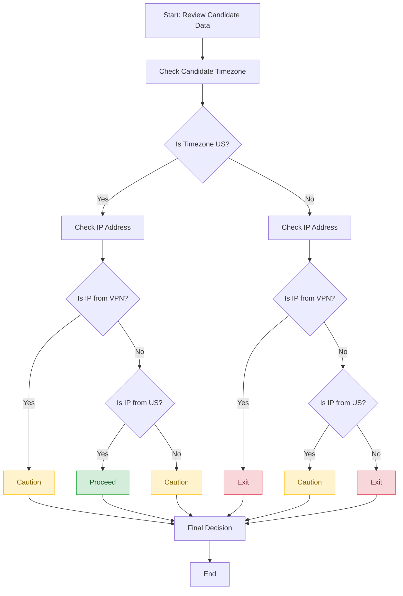
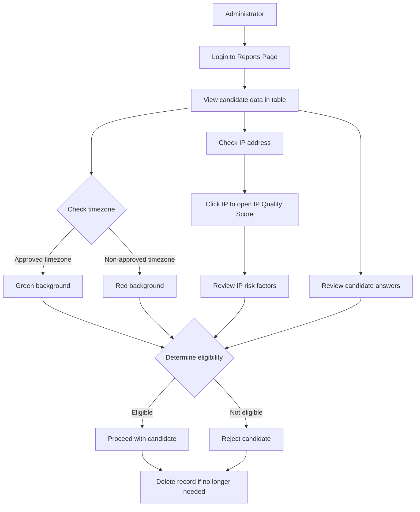
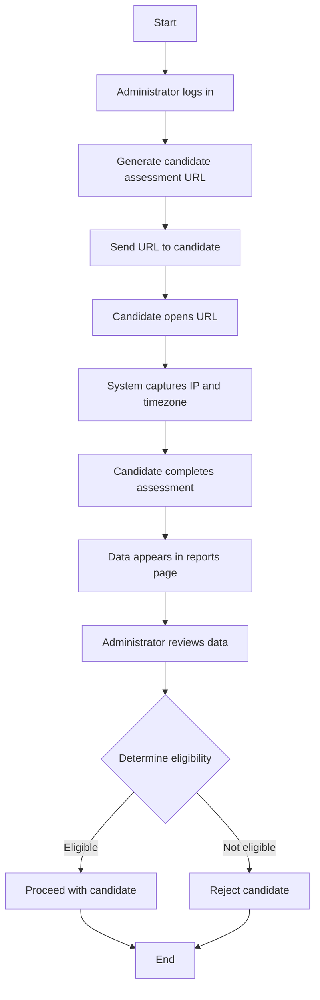

# Candidate Location Assessment Tool

## Eligibility Determination Workflow


| | VPN | !VPN && IP not US | !VPN && IP is US |
|------------------|-----|-------------------|------------------|
| Time Zone != US | <span style="color:red">Exit</span> | <span style="color:red">Exit</span> | <span style="color:orange">Caution</span> |
| Time Zone == US | <span style="color:orange">Caution</span> | <span style="color:orange">Caution</span> | <span style="color:green">Proceed</span> |

### Decision Flow Diagram

The following diagram illustrates the logical decision process for determining candidate eligibility based on their location data:



### Administrator Review Process

This diagram shows the steps an administrator takes when reviewing candidate data:



### Complete Eligibility Workflow

This diagram provides a comprehensive view of the entire eligibility determination process:




# Current Limitations

## Extra Candidate IDs
Unfamiliar Candidate IDs in the report may result from anyone manipulating the URL query string to add data with any candidateId value to the table. Increased frequency may indicate intentional tampering, necessitating security measures to restrict table access.

## Time Zone List
The list of time zones included here may not be exhaustive for the continental US. Verify if any US time zones are incorrectly marked red, indicating they are outside the US. If any are found, update the list to include the new time zone.

The list includes time zones in states where we currently hire and states where we do not. For example, we don't hire in California, but the America/Los_Angeles time zone is on the list because some areas in Oregon may also use it. Similarly, most areas on the East Coast use the New_York time zone.

# Nuxt 3 Minimal Starter

Look at the [Nuxt 3 documentation](https://nuxt.com/docs/getting-started/introduction) to learn more.

## Setup

Make sure to install the dependencies:

```bash
# yarn
yarn install

# npm
npm install

# pnpm
pnpm install
```

## Development Server

Start the development server on http://localhost:3000

```bash
npm run dev
```

## Production

Build the application for production:

```bash
npm run build
```

Locally preview production build:

```bash
npm run preview
```

Check out the [deployment documentation](https://nuxt.com/docs/getting-started/deployment) for more information.
